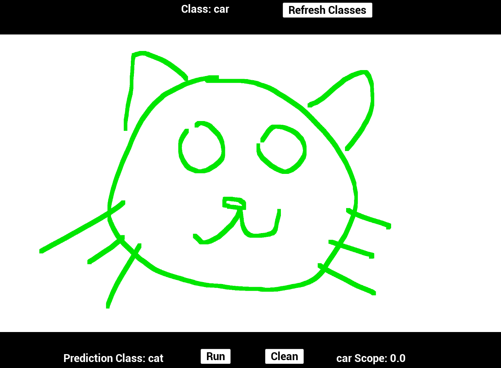
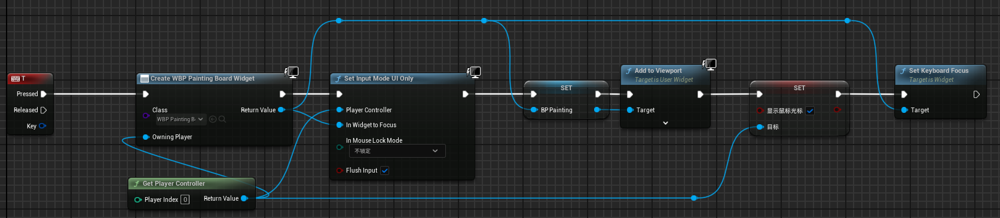
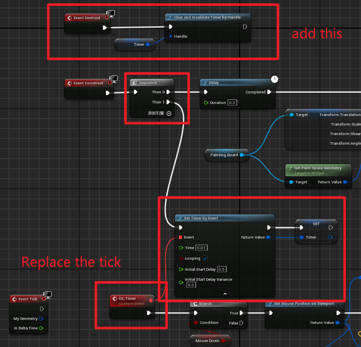

# Installation Steps

1. Create a folder named "Plugins" in your Unreal Engine project directory.
2. Place this plugin into the "Plugins" folder.
3. Open your Unreal Engine project and enable this plugin.

# Demo

- Double-click to run the level named "Demo" in the plugin's `/Content/` directory.
- Follow the on-screen instructions in the top-left corner, press the "T" key to open the drawing board.
- Use your mouse or trackpad to sketch on the canvas, then click the "Run" button at the bottom. The recognized category will be displayed on the bottom-left, while your artwork's score for the current prompted category will be shown on the bottom-right.
- There are 344 identifiable categories.
- Example:
  


# Notes

- If your project is under development, avoid using "Rebuild" in Visual Studio frequently, as rebuilding will clean the project and remove the `.dll` and `.pdb` files in `\Binaries\Win64` within the plugin, causing the editor to fail to run. Therefore, please keep a backup of the original plugin files so you can copy them over in case of issues to maintain project functionality.
- Avoid naming the test project "test" when testing this plugin, as it may cause project packaging to fail.

# Improvement

- This version of the code uses Tick to collect data, which sometimes causes sampling failure. You can change it according to the following figure:
  -  In Demo Level Blueprint
    
  -  In WBP_painting_board Blueprint
     

# Bugs

- The blueprint logic for getting data sometimes fails(but it's very rare), resulting in the following error:
```python
LogNNE: Error: Non-zero status code returned while running ScatterElements node. Name:'/GraphConv.0/conv1/aggr_module/ScatterElements_1' Status Message: indices element out of data bounds, idx=4912850170050325528 must be within the inclusive range [-100,99]
LogTemp: Predict_Lable:0
LogTemp: model reasoning success
LogNNE: Error: Non-zero status code returned while running ScatterElements node. Name:'/GraphConv.0/conv1/aggr_module/ScatterElements_1' Status Message: indices element out of data bounds, idx=4918620407075962880 must be within the inclusive range [-100,99]
LogTemp: Predict_Lable:0
LogTemp: model reasoning success
```

# Reference

- The model used here is the official model from our paper, "DSSG: Spatiotemporal Sketch Representation for Graph Data" (ICIVIS-2024), of which I am the first author. More implementation details of this model are provided in the paper, and it can also be referenced for data retrieval in Unreal Engine Blueprints and data processing logic in code.
